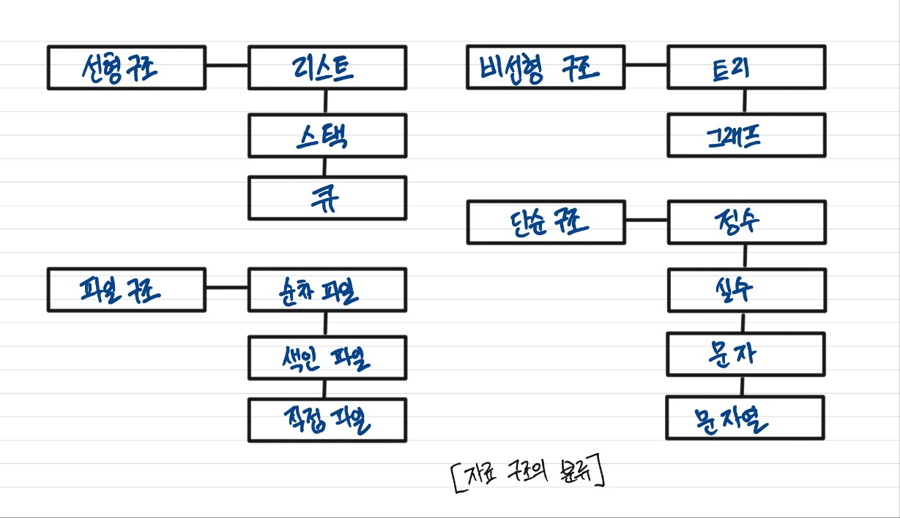
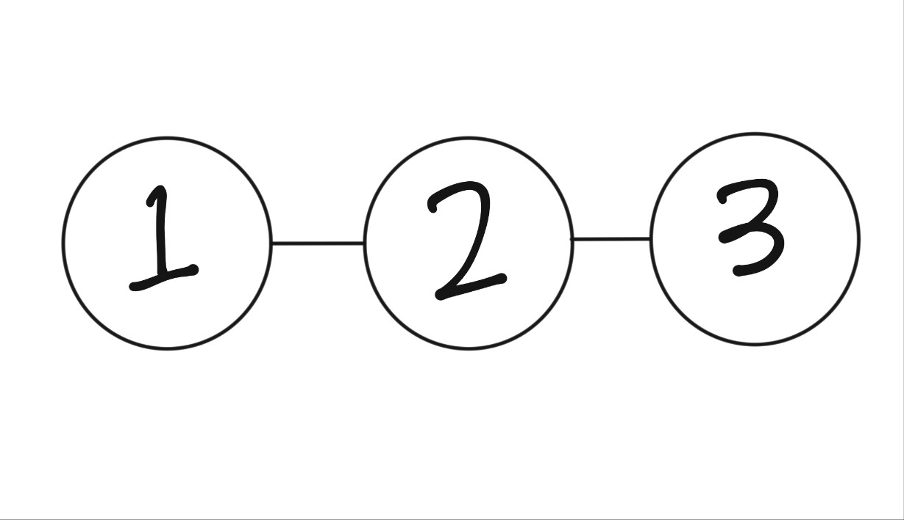
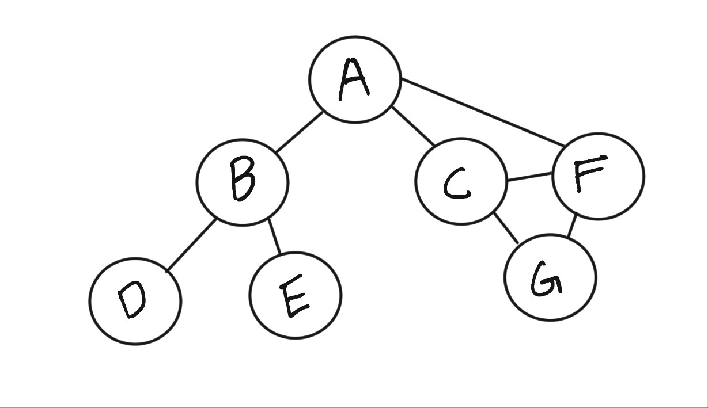

# `자료구조와 알고리즘의 이해`

# 자료구조 기본 이해

> `자료구조 : 데이터를 표현하고 저장하는 방법`

<p align="center">
  
</p>

## 선형 자료구조

> 자료를 구성하는 원소들을 하나씩 순차적으로 나열

<p align="center">
  
</p>

## 비선형 자료구조

> 하나의 자료 뒤에 여러개의 자료가 존재

<p align="center">
  
</p>

## 자료구조와 알고리즘

> 효율적인 자료구조가 성능 좋은 알고리즘의 기반
>
> 자료의 효율적 관리는 프로그램의 수행속도와 관련

# 알고리즘의 성능 분석 방법

## 시간 복잡도(Time Complexity) - 얼마나 오래 걸리냐?

- **정의**: 알고리즘이 **처리해야할 데이터 수 \( n \)**에 따라 **얼마나 많은 연산(또는 시간이)** 필요한지
- **목적**: 실행 속도 예측
- **표현 방식**: 보통 **빅오 표기법**(Big-O)으로 표현, n에대한 연산횟수의 함수 T(n)
  예: `O(1)`, `O(n)`, `O(log n)`, `O(n^2)`

  | 알고리즘 유형 | 시간복잡도 | 예시 함수        |
  | ------------- | ---------- | ---------------- |
  | 상수 시간     | O(1)       | 배열 인덱스 접근 |
  | 선형 시간     | O(n)       | 선형 탐색        |
  | 로그 시간     | O(log n)   | 이진 탐색        |
  | 선형로그 시간 | O(n log n) | 병합정렬, 퀵정렬 |
  | 제곱 시간     | O(n²)      | 이중 for문 탐색  |

## 공간 복잡도(Space Complexity) - 얼마나 많은 공간을 쓰냐?

- **정의**: 알고리즘이 **입력 크기 \( n \)**에 따라 **얼마나 많은 메모리 공간**을 사용하는지
- **포함 요소**:

  - 입력을 저장하기 위한 공간
  - 알고리즘 자체에서 사용하는 변수, 배열, 재귀 스택 등

  | 상황           | 공간복잡도 | 설명                                      |
  | -------------- | ---------- | ----------------------------------------- |
  | 임시 변수 없음 | O(1)       | 일정한 메모리만 사용함 (예: 값 하나 저장) |
  | 배열 사용      | O(n)       | 입력 크기만큼 공간 필요 (예: 복사본 생성) |
  | 재귀 깊이 n    | O(n)       | 함수 호출 스택이 깊어짐                   |

## 순차 탐색(linear search) 알고리즘과 시간 복잡도 분석의 핵심요소

- linearSearch.c
  ```c
  for( i = 0; i < len; i++)
  {
    if(ar[i] == target)
      return i;
  }
  ```

T(n)에서 len이 n이 될꺼고 그럼 이제 어떤 연산을 기준으로 잡아야 하는지 봐야하지

현재 연산 `< ++ ==`, 중에서 핵심이 되는 연산은 `==` 비교 연산이다. 비교연산에 따라 `< ++`의 연산횟수가 달라지니까!

순차 탐색의 시간 복잡도는 배열 len에 따라 얼마나 많은 `==`연산을 하는지를 T(n)으로 표현하면 되겠네

- 최선의 경우

  운이 좋아서 비교연산 횟수가 1일때 -> 알고리즘에 있어서 관심대상이 아님

- 최악의 경우

  운이 안좋아서 비교연산 횟수가 n일때 -> **알고리즘의 성능을 판단할 때는 최악의 경우를 따져봐야함**

> 물론 평균적인 경우도 알고리즘의 성능을 판단하는 기준이지만 "어떤 상황이 평균적이 상횡인가"를 논란의 소지가 많음"

## 최악의 경우(worst case)

**최악의경우에 데이터수 n에 대한 연산횟수의 함수**구하기

> 순차 탐색의 경우 T(n) = n

## 평균적인 경우(average case)

> T(n) = (1/2)*n + (1/2)*n/2 = (3/4)\*n
